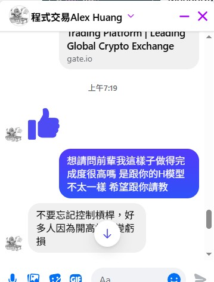
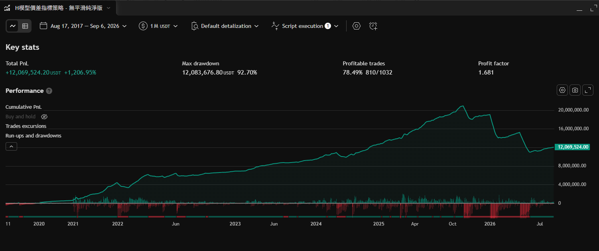

# ALEX H-Model 自動量化交易系統

**GitHub Codespaces & GitHub Actions + Gate.io 全自動部署**

一套完整的 Python 量化交易系統，透過 H-Model 策略監控 Gate.io 現貨與永續合約價差，自動執行交易信號。

## 📋 系統概述

### 核心特性
- **自動化交易**: 每小時自動執行 GitHub Actions 排程任務
- **價差策略**: 監控現貨與永續合約價差（Spread%）
- **乖離策略**: 計算日線偏離率（BIAS%）作為入場條件
- **風險管理**: 倉位限制、槓桿控制、Telegram 實時告警
- **異常重試**: API 調用失敗自動重試機制

### 交易信號規則

| 信號類型 | 觸發條件 (邏輯 AND) | 執行動作 |
|---------|------------------|--------|
| **進場信號** | `BIAS% < -5%` AND `Spread% < -0.5%` | 市價建立/加碼做多合約 |
| **平倉信號** | `BIAS% > 0%` | 市價平掉所有多單 |

## 🗂️ 目錄結構

```
Alex_H_Model/
├── .devcontainer/
│   └── devcontainer.json      # Codespaces 開發環境配置
├── .github/
│   └── workflows/
│       └── trade.yml           # GitHub Actions 自動化工作流
├── config.py                   # 全域參數設定與環境變數管理
├── strategy.py                 # 核心 H-Model 策略與 Gate.io API 模組
├── requirements.txt            # Python 依賴套件清單
├── .env.example                # 本地開發環境變數範本
└── README.md                   # 項目說明文件
```

## 🚀 快速開始

### 方式 1: GitHub Codespaces (推薦)

1. **Fork 本倉庫** 到你的 GitHub 賬號
2. **在 Codespaces 中開啟**
   ```bash
   # 進入 Codespaces 後自動會執行 postCreateCommand
   # 依賴套件會自動安裝
   ```
3. **配置環境變數**
   ```bash
   cp .env.example .env
   # 編輯 .env 並填入你的 API 密鑰
   ```
4. **本地測試策略**
   ```bash
   python strategy.py
   ```
5. **推送至 GitHub** 並配置 Secrets

### 方式 2: 本地開發

```bash
# 1. Clone 倉庫
git clone https://github.com/YOUR_USERNAME/Alex_H_Model.git
cd Alex_H_Model

# 2. 創建虛擬環境
python3.10 -m venv venv
source venv/bin/activate  # Linux/Mac
# 或
venv\Scripts\activate  # Windows

# 3. 安裝依賴
pip install -r requirements.txt

# 4. 配置環境變數
cp .env.example .env
# 編輯 .env 文件填入實際密鑰

# 5. 執行策略
python strategy.py
```

## 🔐 安全性配置

### Gate.io API 密鑰申請

1. 登入 [Gate.io](https://www.gate.io)
2. 進入 **API 管理** → **建立新 API Key**
3. **關鍵權限設置**（僅勾選）:
   - ✅ **Futures (永續合約)**: 讀取 + 寫入
   - ❌ **提現 (Withdraw)**: 嚴禁勾選
   - ❌ 其他高風險權限

### GitHub Secrets 配置

在你的 GitHub 倉庫中設置以下密鑰：

```
Settings → Secrets and variables → Actions → New repository secret
```

| 密鑰名稱 | 描述 |
|---------|------|
| `GATE_API_KEY` | Gate.io API 公鑰 |
| `GATE_API_SECRET` | Gate.io API 私鑰 |
| `TELEGRAM_BOT_TOKEN` | Telegram 機器人 Token |
| `TELEGRAM_CHAT_ID` | Telegram 聊天 ID |
| `TRADING_SYMBOL` | 交易對 (預設: `BTC/USDT`) |
| `LEVERAGE` | 槓桿倍數 (建議: 1-3x) |
| `CONTRACT_SIZE` | 每次交易合約數量 |
| `BIAS_THRESHOLD` | BIAS% 入場閾值 (預設: -5) |
| `SPREAD_THRESHOLD` | Spread% 入場閾值 (預設: -0.5) |

### Telegram 通知設置

1. 在 Telegram 中搜尋 **@BotFather** 建立新機器人
2. 複製機器人 Token 至 GitHub Secrets
3. 將機器人加入你的聊天群組
4. 向機器人發送任何消息後，訪問：
   ```
   https://api.telegram.org/bot<YOUR_TOKEN>/getUpdates
   ```
5. 複製 `chat.id` 至 GitHub Secrets

## 📊 策略邏輯

### 指標計算公式

#### Daily BIAS% (日線乖離率)
```
BIAS% = ((P_spot_daily - SMA20_daily) / SMA20_daily) × 100
```
- 取現貨每日收盤價與 20 日簡單移動平均線
- 負值表示現價低於均線（超賣信號）

#### Spread% (現期價差率)
```
Spread% = ((P_futures - P_spot) / P_spot) × 100
```
- 取永續合約與現貨的價差百分比
- 負值表示合約價格低於現貨（套利機會）

### 信號規則

**進場條件** (ALL 必須滿足):
- `BIAS% < -5%` (現價明顯低於均線)
- `Spread% < -0.5%` (合約折價)
- 當前倉位 < 最大倉位限制

**平倉條件**:
- `BIAS% > 0%` (現價回升至均線以上)
- 當前持有多單

## 📝 配置參數說明

編輯 `.env` 或 GitHub Secrets 調整以下參數：

```bash
# 交易對設置
TRADING_SYMBOL=BTC/USDT        # 交易對 (BTC/USDT, ETH/USDT 等)
LEVERAGE=1                      # 槓桿倍數 (建議 1-3x)
CONTRACT_SIZE=1                 # 每次交易數量

# 策略參數
BIAS_THRESHOLD=-5              # BIAS% 入場閾值 (越負越容易進場)
SPREAD_THRESHOLD=-0.5          # Spread% 入場閾值 (越負越容易進場)

# 風險管理
MAX_POSITION_SIZE=10            # 最大持倉合約數 (config.py 中設置)

# 調試
DEBUG_MODE=false                # 開啟詳細日誌輸出
```

## 🔄 工作流程

### 自動化流程 (GitHub Actions)

1. **每小時 00 分觸發** (`0 * * * *`)
2. 檢出最新代碼
3. 安裝 Python 3.10 和依賴
4. 讀取 GitHub Secrets
5. 執行 `strategy.py`
6. 輸出交易日誌與 Telegram 告警

### 本地測試流程

```bash
# 手動執行一次交易循環
python strategy.py

# 預期輸出:
# [CYCLE START] 2024-XX-XX HH:MM:SS
# [METRICS] BIAS%: -5.24%, Spread%: -0.75%
# [SIGNAL] Bottom Entry triggered!
# [ORDER BUY] ...
# [CYCLE END] 2024-XX-XX HH:MM:SS
```

## 📧 異常通知

系統在以下情況自動發送 Telegram 告警：

- ✅ **交易執行**: 進場/平倉訂單成功
- 🔴 **API 異常**: 網絡連接失敗、交易所返回錯誤
- 📊 **指標計算失敗**: 數據不足或異常
- ⚠️ **倉位風險**: 倉位超限

## ⚠️ 風險警告

### 使用前必讀

1. **模擬交易測試**: 建議先在 Gate.io 模擬盤測試
2. **槓桿風險**: 建議槓桿倍數 1-3x，避免高槓桿清算
3. **資金管理**: 只投入可承受損失的資金
4. **監控系統**: 定期檢查 GitHub Actions 執行日誌
5. **API 權限**: 嚴禁授予提現(Withdraw)權限

### 常見風險

| 風險 | 說明 | 防護 |
|-----|------|------|
| 槓桿清算 | 極端行情導致強制平倉 | 低槓桿 (1-2x)、倉位限制 |
| API 密鑰洩露 | 賬戶資金被盜 | GitHub Secrets 保護、限制權限 |
| 網絡延遲 | 訂單執行延遲或失敗 | 自動重試機制、Telegram 通知 |
| 策略失效 | 市場條件改變策略無效 | 定期回測、參數調優 |

## 🛠️ 故障排除

### 問題 1: GitHub Actions 執行失敗

**症狀**: Actions 日誌顯示錯誤

**解決方案**:
```bash
# 1. 檢查 Secrets 是否正確配置
# Settings → Secrets → 確認所有必要 Secrets 已設置

# 2. 本地測試
python strategy.py

# 3. 檢查日誌
# Actions → 最近的 workflow run → 查看具體錯誤信息
```

### 問題 2: API 連接失敗

**症狀**: `[ERROR] Network error` 或 `Exchange error`

**解決方案**:
```bash
# 1. 確認網絡連接正常
ping www.gate.io

# 2. 驗證 API 密鑰正確
# Gate.io → API Management → 確認 Key 和 Secret

# 3. 檢查 API 權限
# 確保只勾選 Futures (讀取+寫入)

# 4. 查看 Gate.io 服務狀態
# https://www.gate.io/status
```

### 問題 3: 未收到 Telegram 通知

**症狀**: 交易執行但沒有收到通知

**解決方案**:
```bash
# 1. 驗證 Telegram Bot Token 和 Chat ID
# 發送測試消息驗證

# 2. 檢查機器人是否在聊天群組中
# 將機器人加入對應聊天群組或頻道

# 3. 本地測試
TELEGRAM_BOT_TOKEN=xxx TELEGRAM_CHAT_ID=yyy python strategy.py
```

## 📈 性能優化建議

### 1. 策略參數調優

根據市場行情調整進場閾值：

```python
# 牛市: 提高進場難度 (BIAS 更負)
BIAS_THRESHOLD = -8.0
SPREAD_THRESHOLD = -1.0

# 熊市: 降低進場難度 (BIAS 更接近 0)
BIAS_THRESHOLD = -2.0
SPREAD_THRESHOLD = -0.2
```

### 2. 執行頻率優化

修改 GitHub Actions cron 表達式：

```yaml
on:
  schedule:
    # 每 30 分鐘執行一次
    - cron: '*/30 * * * *'
    
    # 每 4 小時執行一次
    - cron: '0 */4 * * *'
```

### 3. 資金管理

- 設置合理的 `MAX_POSITION_SIZE`
- 分次進場 (每次 `CONTRACT_SIZE` 小於 `MAX_POSITION_SIZE`)
- 避免單次全倉進場

## 🖼️ 圖片與參考

### 策略討論與參數說明




### 回測結果



### H-Model 課程參考


### 延伸閱讀

- [H-Model 相關文章](https://vocus.cc/article/6a977278fd8978000173189c)

## 📚 相關資源

- [Gate.io API 文檔](https://www.gate.io/docs/developers/apiv4)
- [CCXT 文檔](https://docs.ccxt.com)
- [Pine Script to Python 轉換指南](https://github.com/ccxt/ccxt/wiki)
- [Telegram Bot API](https://core.telegram.org/bots/api)

## 📄 許可證

MIT License - 可自由使用、修改和分發

## ⚖️ 免責聲明

本系統僅供教育和研究使用，不構成投資建議。使用者應自行承擔所有風險。
開發者不對交易損失負任何責任。

**使用本系統交易前，請務必：**
- 充分了解交易風險
- 進行充分的模擬測試
- 只投入可承受損失的資金
- 定期監控系統運行狀態

---

**最後更新**: 2024-09-01
**版本**: v1.0.0
**狀態**: Production-Ready ✅